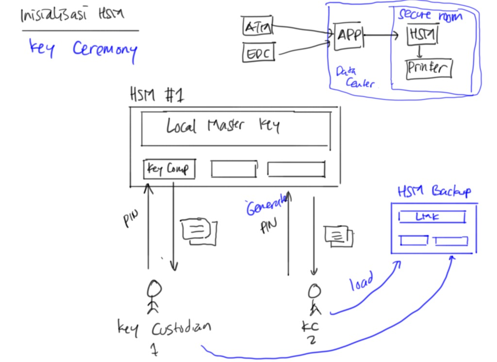
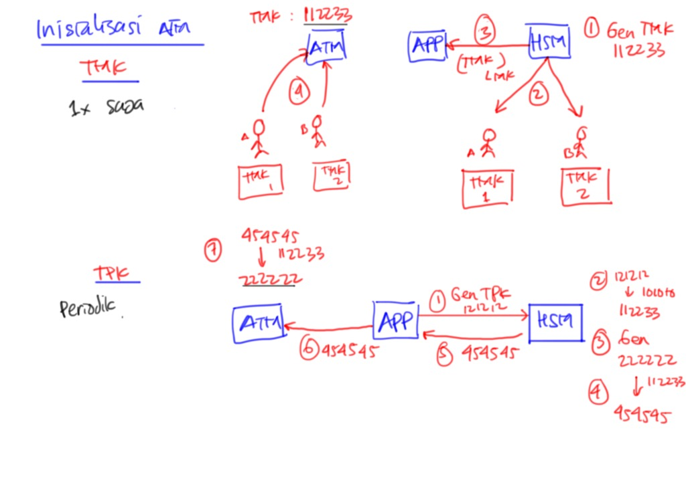
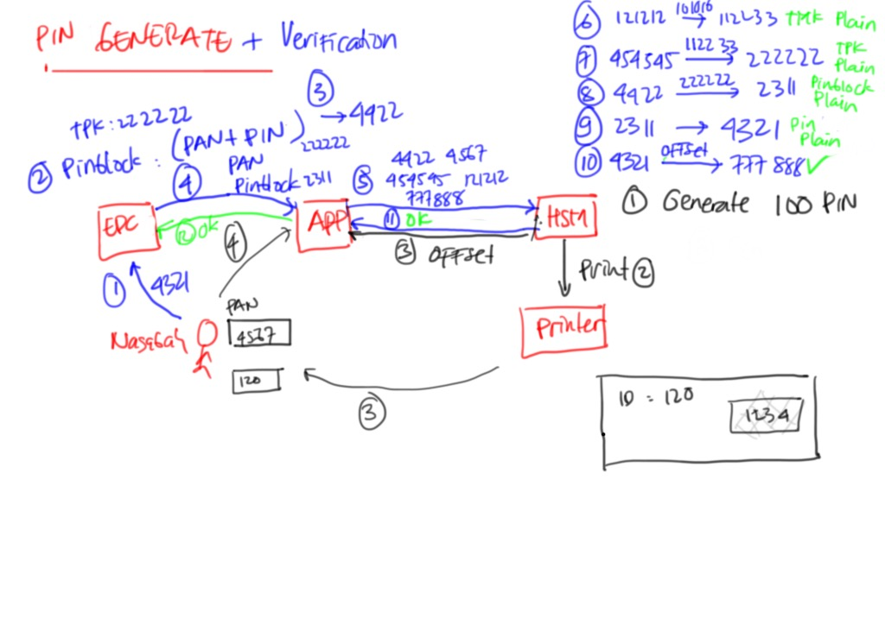
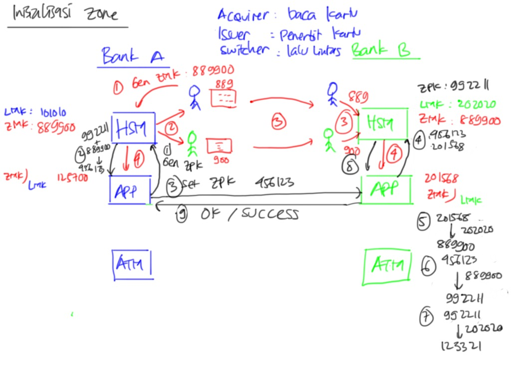
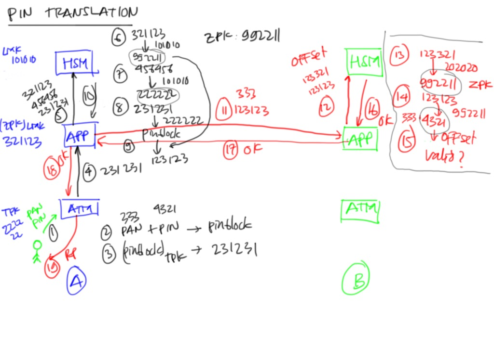

# Training ISO-8583 #

Materi:

* Konsep ISO-8583

    * MTI
    * Bitmap
    * Network Protocol

* Konsep HSM

    * LMK
    * TMK
    * TPK
    * ZMK
    * ZPK

* Inisialisasi HSM

    * Key Custodian
    * LMK Generation
    * Key Component

* Inisialisasi ATM/EDC

    * Generate TMK
    * Install TMK di Perangkat
    * Generate TPK
    * Key Exchange TPK

* Generate PIN

    * Generate PIN
    * Print PIN Mailer
    * PIN offset

* Verifikasi PIN di ATM

    * Entri PIN
    * Generate PIN block
    * Encrypt PIN block dengan TPK
    * Kirim ke ATM Server
    * Verifikasi di HSM

* Inisialisasi Zone

    * Generate ZMK
    * Install ZMK di HSM
    * Key Exchange ZPK

* PIN Translation

    * Input PIN
    * Generate PIN block
    * Encrypt PIN block dengan TPK
    * Translate enkripsi TPK menjadi ZPK
    * Kirim pin block under ZPK ke mitra

* Implementasi beberapa transaksi yang sering dilakukan

    * Cek Saldo
    * Tarik Tunai
    * Transfer On Us (sesama bank)
    * Transfer Off Us (beda bank)
        
        * Sebagai issuer (mengeluarkan uang)
        * Sebagai beneficiary (menerima uang)

## Simulator HSM ##

* https://archive.codeplex.com/?p=thalessim
* http://www.m-sinergi.com/hairi/

## Referensi ##

* https://github.com/gjyoung1974/Thales9kUtil
* http://jpos.org/w/index.php/HSM_basics
* http://jpos.org/w/index.php/HSM_basics_continued
* https://github.com/endymuhardin/training-iso8583-jpos-2016-02/blob/master/materi/hsm.md
* http://sidekick.windforwings.com/2008/02/how-are-atm-pins-validated.html
